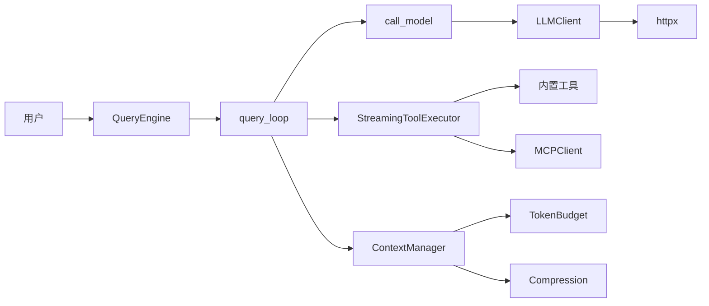

# Claude Core

Claude Code 核心功能的 Python 实现，提供 LLM 查询、工具执行、上下文管理、Agent 嵌套等能力。

## 安装

```bash
pip install -e .
```

或安装依赖：

```bash
pip install -e ".[dev]"
```

## 快速开始

### 基本用法

```python
import asyncio
from claude_core import QueryEngine, QueryEngineConfig

async def main():
    config = QueryEngineConfig(
        api_key="your-api-key",
        base_url="https://api.openai.com/v1",  # 或其他兼容 API
        model="gpt-4o",
    )

    engine = QueryEngine(config)

    # 发送消息并获取流式响应
    async for event in engine.submit_message("你好，请介绍一下你自己"):
        if isinstance(event, dict):
            if event.get("type") == "content":
                print(event.get("content", ""), end="", flush=True)
        else:
            print(event)

asyncio.run(main())
```

### 带工具调用的用法

```python
import asyncio
from claude_core import QueryEngine, QueryEngineConfig
from claude_core.tools.builtin import create_file_read_tool, create_bash_tool

async def main():
    config = QueryEngineConfig(
        api_key="your-api-key",
        model="gpt-4o",
    )

    engine = QueryEngine(config)

    # 使用内置工具
    engine.set_tools([
        create_file_read_tool(),
        create_bash_tool(),
    ])

    async for event in engine.submit_message("帮我读取 /tmp/example.txt"):
        print(event)

asyncio.run(main())
```

内置工具包括：`FileRead`、`FileWrite`、`FileEdit`、`Glob`、`Grep`、`Bash`。

### 非流式响应（简单接口）

```python
import asyncio
from claude_core import QueryEngine, QueryEngineConfig

async def main():
    config = QueryEngineConfig(
        api_key="your-api-key",
        model="gpt-4o",
    )

    engine = QueryEngine(config)
    response = await engine.ask("1+1等于几？")
    print(response)

asyncio.run(main())
```

### 运行示例

确保设置环境变量后即可运行：

```bash
# 设置 API key
export OPENAI_API_KEY=your-api-key

# 运行交互式对话示例
python examples/simple_chat.py

# 运行带工具调用的示例
python examples/with_tools.py

# 或直接运行 SDK（单次对话）
python -m claude_core
```

更多示例见 [examples/](./examples/) 目录。

## 项目结构

```
claude-core/
├── src/claude_core/
│   ├── __init__.py           # SDK 入口，导出主要接口
│   ├── api/                  # HTTP 客户端
│   │   ├── client.py         # LLMClient（OpenAI 兼容）
│   │   ├── errors.py         # 错误类型定义
│   │   └── types.py          # API 类型定义
│   ├── engine/               # 核心引擎
│   │   ├── query_engine.py   # QueryEngine（高级编排器）
│   │   ├── query_loop.py     # query()（核心生成器）
│   │   └── config.py         # QueryEngineConfig
│   ├── models/               # 数据模型
│   │   ├── message.py        # 消息类型
│   │   └── tool.py           # 工具相关类型
│   ├── tools/                # 工具系统
│   │   ├── streaming_executor.py  # 流式工具执行器
│   │   ├── registry.py       # 工具注册表
│   │   └── builtin/          # 内置工具
│   │       ├── bash.py       # Bash 命令执行
│   │       ├── file_read.py  # 文件读取
│   │       ├── file_write.py # 文件写入
│   │       ├── file_edit.py  # 文件编辑
│   │       ├── glob.py       # 文件搜索
│   │       └── grep.py       # 内容搜索
│   ├── context/              # 上下文管理
│   │   ├── manager.py        # ContextManager
│   │   ├── compression.py    # 压缩策略
│   │   └── budget.py         # 令牌预算
│   ├── prompt/               # Prompt 构建
│   │   ├── builder.py        # PromptBuilder
│   │   └── templates.py      # 默认模板
│   ├── agents/               # Agent 系统
│   │   └── worker.py         # WorkerAgent
│   ├── mcp/                  # MCP 客户端
│   │   └── client.py         # MCP JSON-RPC 客户端
│   └── langfuse/             # 分布式追踪
│       └── client.py         # LangfuseTracer
└── tests/                    # 测试
    ├── smoke/                 # Smoke tests (no API key required)
    │   ├── test_query_loop_smoke.py
    │   ├── test_tool_executor_smoke.py
    │   ├── test_agent_smoke.py
    │   └── test_prompt_manager_smoke.py
```

## 核心概念

### QueryEngine

高级编排器，管理会话状态和对话生命周期。

```python
engine = QueryEngine(config)
engine.set_tools([...])        # 设置可用工具
engine.set_system_prompt(...)  # 设置系统提示
engine.set_can_use_tool(...)   # 设置工具权限回调
```

### query() 主循环

核心异步生成器，管理对话循环、API 调用、工具执行、上下文压缩。

```python
async for event in query(params):
    if event.type == "content":
        print(event.content)
    elif event.type == "tool_use":
        print(f"调用工具: {event.name}")
    elif event.type == "tool_result":
        print(f"工具结果: {event.content}")
```

### StreamingToolExecutor

并发执行工具，支持输入验证和权限检查。

```python
executor = StreamingToolExecutor(
    tool_definitions=tools,
    can_use_tool=can_use_tool_callback,
    tool_use_context=context,
)
```

### 上下文压缩

当消息历史过长时自动压缩，支持多种策略：

- **SnipCompact**：移除中间消息
- **AutoCompactStrategy**：自动压缩
- **ReactiveCompact**：错误后反应式压缩

## 配置选项

### QueryEngineConfig

| 参数 | 类型 | 默认值 | 描述 |
|------|------|--------|------|
| `api_key` | str | - | API 密钥（必填） |
| `base_url` | str | `https://api.openai.com/v1` | API 基础 URL |
| `model` | str | `gpt-4o` | 模型名称 |
| `max_turns` | int | None | 最大对话轮次 |
| `max_output_tokens` | int | None | 最大输出 tokens |
| `timeout` | float | 120.0 | HTTP 超时（秒） |

## 前置条件

- Python >= 3.11
- 安装 dev 依赖：`pip install -e ".[dev]"`

## 运行测试

```bash
# 运行所有测试
python -m pytest

# 运行 smoke tests（不需要 API key）
python -m pytest tests/smoke/

# 运行所有测试（详细输出）
python -m pytest tests/ -v
```

## 示例

项目包含多个可直接运行的示例：

| 示例 | 说明 |
|------|------|
| `examples/simple_chat.py` | 基本对话，展示流式响应 |
| `examples/with_tools.py` | 演示工具注册和调用 |

运行前设置环境变量：

```bash
export OPENAI_API_KEY=your-api-key
export OPENAI_BASE_URL=https://api.openai.com/v1  # 可选
export OPENAI_MODEL=gpt-4o  # 可选

python examples/simple_chat.py
```

## 文档

- [代码阅读指南](./docs/code-reading/) - 完整的代码流转文档
- [API 文档](./docs/code-reading/) - 各模块详细说明

## 架构概览


