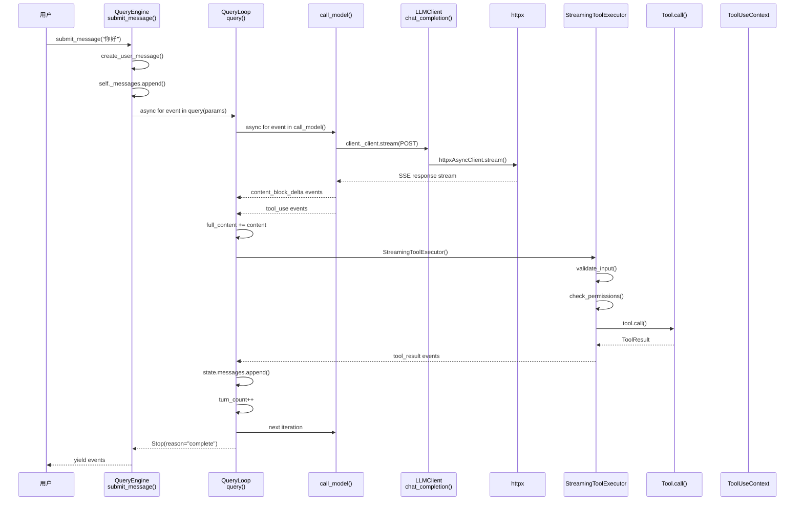
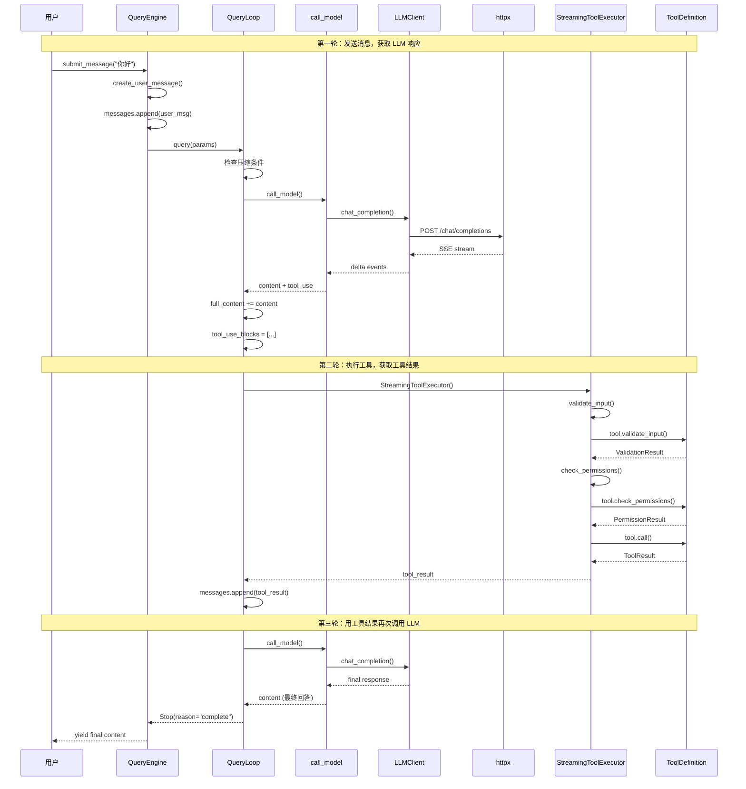
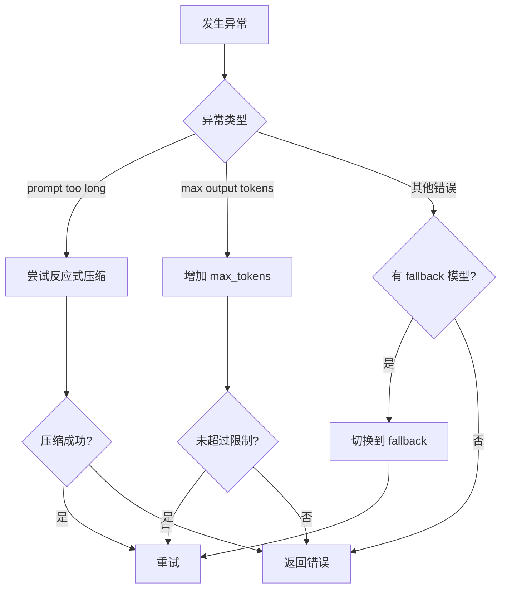

# 消息处理完整代码流转

本文档追踪一条用户消息从接收，到最终响应的完整代码流转路径。

## 执行流程总览



## 第一阶段：入口与消息创建

### 1.1 用户调用 submit_message()

**文件**: `src/claude_core/engine/query_engine.py:57`

```python
async def submit_message(
    self,
    content: str,
    attachments: list | None = None,
) -> AsyncGenerator[StreamEvent | dict, None]:
```

**执行步骤**:

1. **创建用户消息** (`query_engine.py:73`)
   ```python
   user_msg = create_user_message(content=content)
   self._messages.append(user_msg)
   ```
   调用 `create_user_message()` 创建 `UserMessage` 对象并加入消息历史

2. **获取或创建 LLMClient** (`query_engine.py:77`)
   ```python
   client = await self._get_client()
   ```
   懒初始化：首次使用时创建 `LLMClient`

3. **构建 QueryParams** (`query_engine.py:94-105`)
   ```python
   params = QueryParams(
       messages=self._messages,
       system_prompt=self._system_prompt,
       user_context={},
       system_context={},
       can_use_tool=self._can_use_tool,
       tool_use_context=self._tool_use_context,
       max_turns=self._config.max_turns,
       fallback_model=None,
       query_source="sdk",
   )
   ```

4. **设置 AbortController** (`query_engine.py:110-112`)
   ```python
   tool_use_context.abort_controller = create_child_abort_controller(
       self._abort_controller
   )
   ```

### 1.2 create_user_message() 消息工厂

**文件**: `src/claude_core/models/message.py:56`

```python
def create_user_message(
    content: str | list[dict],
    uuid: Optional[str] = None,
    tool_use_result: Any = None,
    source_tool_assistant_uuid: Optional[str] = None,
) -> UserMessage:
```

**执行步骤**:

1. 规范化内容为 list 格式
2. 生成 UUID（如果没有提供）
3. 构建 message 字典
4. 返回 `UserMessage` 实例

---

## 第二阶段：查询循环主循环

### 2.1 query() 主生成器

**文件**: `src/claude_core/engine/query_loop.py:139`

```python
async def query(
    params: QueryParams,
) -> AsyncGenerator[StreamEvent | dict, Continue | Stop]:
```

这是核心的异步生成器函数，管理整个对话生命周期。

### 2.2 初始化阶段 (`query_loop.py:158-190`)

1. **创建 QueryState**
   ```python
   state = QueryState(
       messages=params.messages,
       tool_use_context=params.tool_use_context,
       max_output_tokens_override=params.max_output_tokens_override,
   )
   ```

2. **初始化压缩策略**
   ```python
   snip_compact = SnipCompact(threshold=50000)
   auto_compact = AutoCompactStrategy(threshold=80000)
   ```

3. **初始化令牌预算**（如果配置了 max_budget）
   ```python
   if params.tool_use_context.options.max_budget_usd:
       budget = TokenBudget(max_tokens=int(params.tool_use_context.options.max_budget_usd * 1000))
   ```

### 2.3 主循环条件检查 (`query_loop.py:191-206`)

```python
while True:
    # 检查最大轮次
    if params.max_turns and state.turn_count >= params.max_turns:
        yield Stop(reason="max_turns")
        return

    # 检查中止信号
    if state.tool_use_context.abort_controller.signal.aborted:
        yield Stop(reason="aborted")
        return

    # 检查预算
    if budget and budget.is_exhausted():
        yield Stop(reason="budget_exhausted")
        return
```

### 2.4 上下文压缩检查 (`query_loop.py:207-215`)

```python
# Snip 压缩：如果消息过长
if snip_compact.should_compact(state.messages):
    result = snip_compact.compact(state.messages)
    state.messages = result.messages
    yield {
        "type": "compaction",
        "tokens_freed": result.tokens_freed,
        "reason": "snip",
    }
```

**为什么要压缩？** 当消息历史超过阈值时，移除中间的消息（保留开头和结尾），避免超出模型的上下文窗口。

### 2.5 消息格式化 (`query_loop.py:231-245`)

```python
api_messages = []
for msg in state.messages:
    if isinstance(msg, UserMessage):
        api_messages.append({"role": "user", "content": str(content)})
    elif isinstance(msg, AssistantMessage):
        api_messages.append({"role": "assistant", "content": str(content)})
```

将内部消息格式转换为 API 格式。

---

## 第三阶段：API 调用

### 3.1 call_model() 流式调用

**文件**: `src/claude_core/engine/query_loop.py:30`

```python
async def call_model(
    client: LLMClient,
    messages: list[MessageParam],
    system_prompt: str,
    tools: list | None = None,
    max_tokens: int = DEFAULT_MAX_OUTPUT_TOKENS,
    abort_controller: AbortController | None = None,
) -> AsyncGenerator[StreamEvent, None]:
```

### 3.2 消息格式化 (`call_model.py:48-56`)

```python
formatted_messages = [{"role": "system", "content": system_prompt}]
for msg in messages:
    if isinstance(msg, dict):
        formatted_messages.append(msg)
    else:
        formatted_messages.append({
            "role": msg.type if hasattr(msg, 'type') else "user",
            "content": str(msg.message.get("content", "")) if hasattr(msg, 'message') else str(msg)
        })
```

**关键点**：系统提示被前置到消息列表的最前面。

### 3.3 HTTP 流式请求 (`call_model.py:64-75`)

```python
async with client._client.stream(
    "POST",
    f"{client.base_url}/chat/completions",
    headers=client._build_headers(),
    json={
        "model": client.model,
        "messages": formatted_messages,
        "stream": True,
        "max_tokens": max_tokens,
        **({"tools": tools} if tools else {}),
    },
) as response:
```

**关键点**：
- 使用 `stream()` 而非 `post()` 实现 Server-Sent Events (SSE)
- `stream: True` 告诉 API 使用流式响应

### 3.4 SSE 响应解析 (`call_model.py:76-136`)

```python
async for line in response.aiter_lines():
    line = line.strip()
    if not line or line.startswith("#"):
        continue

    if line.startswith("data: "):
        data = line[6:]
        if data == "[DONE]":
            yield MessageStopEvent()
            break

        chunk = json.loads(data)

        # 内容增量
        if delta.get("content"):
            yield ContentBlockDeltaEvent(
                index=choice.get("index", 0),
                delta={"content": delta["content"]}
            )

        # 工具调用
        if delta.get("tool_calls"):
            for tc in delta["tool_calls"]:
                yield ToolUseEvent(
                    tool_use_id=str(tc.get("id", "")),
                    name=tc.get("function", {}).get("name", ""),
                    input=json.loads(tc.get("function", {}).get("arguments", "{}")),
                )
```

**SSE 格式示例**：
```
data: {"choices":[{"delta":{"content":"Hello"},"index":0}]}

data: {"choices":[{"delta":{"tool_calls":[...]}}]}

data: [DONE]
```

---

## 第四阶段：流式响应收集

### 4.1 回到 query() 主循环 (`query_loop.py:280-305`)

```python
full_content = ""
tool_use_blocks = []

async for event in call_model(...):
    if event.type == "content_block_delta":
        content = event.delta.get("content", "")
        if content:
            full_content += content
            yield {
                "type": "content",
                "content": content,
            }
    elif event.type == "tool_use":
        tool_use_blocks.append({
            "id": event.tool_use_id,
            "name": event.name,
            "input": event.input,
        })
```

**两种响应模式**：

1. **纯文本响应**：直接 yield content 事件
2. **工具调用响应**：收集 tool_use_blocks，稍后执行

### 4.2 错误处理与恢复 (`query_loop.py:307-365`)

```python
except Exception as e:
    error_message = str(e)

    if is_prompt_too_long:
        # 尝试反应式压缩
        if reactive_compact(state.messages, error_message):
            result = auto_compact.compact(state.messages, system_content)
            state.messages = result.messages
            continue  # 重试

    elif is_max_output:
        # 增加 max_tokens 重试（最多 3 次）
        if current_max_tokens < RECOVERY_MAX_TOKENS:
            current_max_tokens = min(current_max_tokens * 2, RECOVERY_MAX_TOKENS)
            continue

    elif params.fallback_model:
        # 尝试备用模型
        current_model = params.fallback_model
        continue
```

**恢复策略优先级**：
1. 反应式压缩 → 重试
2. 增加 max_tokens → 重试
3. 切换 fallback 模型 → 重试
4. 最终错误

---

## 第五阶段：工具执行

### 5.1 StreamingToolExecutor 创建 (`query_loop.py:407-424`)

```python
if tool_use_blocks:
    executor = StreamingToolExecutor(
        tool_definitions=state.tool_use_context.options.tools,
        can_use_tool=params.can_use_tool,
        tool_use_context=state.tool_use_context,
    )

    # 添加所有工具调用块
    for tb in tool_use_blocks:
        block = type('obj', (object,), {
            "id": tb["id"],
            "name": tb["name"],
            "input": tb["input"],
            "type": "tool_use",
        })()
        executor.add_tool(block, assistant_message)
```

### 5.2 add_tool() 添加工具 (`streaming_executor.py:85-126`)

```python
def add_tool(self, block: "ToolUseBlock", assistant_message: Any) -> None:
    tool_def = find_tool_by_name(self._tool_definitions, block.name)

    if not tool_def:
        # 工具不存在，创建错误结果
        self._tools.append(TrackedTool(...))
        return

    # 检查并发安全性
    is_concurrency_safe = tool_def.is_concurrency_safe(parsed_input)

    self._tools.append(TrackedTool(
        id=block.id,
        block=block,
        assistant_message=assistant_message,
        status=ToolStatus.QUEUED,
        is_concurrency_safe=is_concurrency_safe,
    ))

    asyncio.create_task(self._process_queue())
```

**关键点**：
- 如果工具不存在，立即返回错误
- 并发安全的工具可以并行执行
- 使用 `asyncio.create_task()` 非阻塞启动

### 5.3 _execute_tool() 执行工具 (`streaming_executor.py:144-257`)

```python
async def _execute_tool(self, tool: TrackedTool) -> None:
    tool.status = ToolStatus.EXECUTING

    try:
        tool_def = find_tool_by_name(self._tool_definitions, tool.block.name)

        # 1. 输入验证
        validation_result = await tool_def.validate_input(
            tool.block.input or {},
            self._context,
        )
        if not validation_result.result:
            # 返回验证错误
            return

        # 2. 权限检查
        permission_result = await tool_def.check_permissions(
            tool.block.input or {},
            self._context,
        )
        if permission_result.behavior == "deny":
            # 返回权限拒绝
            return

        # 3. 实际调用工具
        result = await tool_def.call(
            tool.block.input or {},
            self._context,
            self._can_use_tool,
            None,
        )

        # 4. 构建结果消息
        messages.append(create_user_message(...))

        # 5. 应用上下文修饰器
        if result.context_modifier:
            context_modifiers.append(result.context_modifier)

    except Exception as e:
        # 捕获异常
        self._has_errored = True

    tool.results = messages
    tool.context_modifiers = context_modifiers
    tool.status = ToolStatus.COMPLETED
```

**执行步骤**：

1. **输入验证** (`streaming_executor.py:167-187`)
   - 调用 `tool.validate_input()`
   - 检查输入是否符合工具的 schema
   - 验证失败返回错误

2. **权限检查** (`streaming_executor.py:189-208`)
   - 调用 `tool.check_permissions()`
   - 检查工具是否有权限执行（如写文件、删除文件等）
   - 权限拒绝返回错误

3. **执行工具** (`streaming_executor.py:210-215`)
   - 调用 `tool.call()`
   - 传入参数、上下文、can_use_tool 回调

4. **处理结果** (`streaming_executor.py:217-232`)
   - 包装为 `UserMessage`（工具结果作为用户消息）
   - 应用上下文修饰器（如果工具修改了上下文）

### 5.4 get_remaining_results() 获取结果 (`streaming_executor.py:307-330`)

```python
async def get_remaining_results(self) -> AsyncGenerator["MessageUpdate", None]:
    while self._has_unfinished_tools():
        await self._process_queue()

        for result in self.get_completed_results():
            yield result

        # 等待执行中的工具完成
        if self._has_executing_tools() and not self._has_completed_results():
            await asyncio.race([*executing_promises, progress_promise])
```

**流程**：
1. 循环直到所有工具完成
2. 处理队列中的工具
3. 产出已完成的结果
4. 等待还在执行中的工具

### 5.5 回到 query() 处理工具结果 (`query_loop.py:426-437`)

```python
async for update in executor.get_remaining_results():
    if update.message:
        yield {
            "type": "tool_result",
            "tool_use_id": update.message.message.get("tool_use_result", {}).get("tool_use_id", ""),
            "content": update.message.tool_use_result,
        }
        state.messages.append(update.message)

# 更新上下文
state.tool_use_context = executor.get_updated_context()
```

**关键点**：
- 工具结果作为新的用户消息添加到历史
- 调用 `get_updated_context()` 获取修改后的上下文

---

## 第六阶段：循环结束

### 6.1 循环继续条件 (`query_loop.py:439-453`)

```python
# 检查停止原因
if stop_reason == "stop" and not tool_use_blocks:
    # 正常完成 - 没有更多工具要执行
    yield Stop(reason="complete")
    return

# 增加轮次计数
state.turn_count += 1

# 如果执行了工具，继续循环
if tool_use_blocks:
    yield Continue()
else:
    # 没有工具也没有内容 - 出错了
    yield Stop(reason="complete")
    return
```

**循环策略**：
- 有工具调用 → 继续下一轮（用工具结果再次调用 LLM）
- 无工具调用 → 检查是否正常完成
- 达到最大轮次 → 停止

### 6.2 回到 submit_message() (`query_engine.py:115-127`)

```python
async for event in query(params):
    if isinstance(event, dict):
        if event.get("type") == "message" and event.get("message"):
            self._messages.append(event["message"])
        yield event
    else:
        yield event
```

**关键点**：
- 将 assistant 消息也添加到历史
- 透传所有事件给调用者

---

## 第七阶段：API 客户端重试逻辑

### 7.1 LLMClient.chat_completion()

**文件**: `src/claude_core/api/client.py:87`

```python
async def chat_completion(
    self,
    messages: list[MessageParam | dict],
    tools: list[ToolParam] | None = None,
    **kwargs: Any,
) -> ChatCompletion:
```

### 7.2 重试循环 (`client.py:109-124`)

```python
for attempt in range(self.max_retries):
    try:
        response = await self._client.post(url, headers=headers, json=body)

        if response.status_code != 200:
            error = self._map_status_to_error(response)

            if not is_retryable_error(error):
                raise error

            if attempt < self.max_retries - 1:
                await asyncio.sleep(retry_delay)
                retry_delay *= 2  # 指数退避
                continue
            else:
                raise error

        return response.json()
```

### 7.3 错误映射 (`client.py:64-85`)

```python
def _map_status_to_error(self, response: httpx.Response) -> APIError:
    if status == 401:
        return AuthenticationError(error_msg)
    elif status == 403:
        return AuthenticationError("Access forbidden")
    elif status == 400:
        return InvalidRequestError(error_msg)
    elif status == 429:
        return RateLimitError(error_msg, retry_after=...)
    elif status >= 500:
        return APIConnectionError(f"Server error: {error_msg}")
```

### 7.4 is_retryable_error() (`client.py:50`)

```python
def is_retryable_error(error: APIError) -> bool:
    """判断错误是否可重试"""
    if isinstance(error, RateLimitError):
        return True
    if isinstance(error, APIConnectionError):
        return True
    return False
```

**重试策略**：
- 429 (Rate Limit) → 重试
- 5xx (Server Error) → 重试
- 401/403 (Auth Error) → 不重试
- 400 (Bad Request) → 不重试

---

## 完整流程时序图



---

## 关键数据结构

### QueryParams

```python
@dataclass
class QueryParams:
    messages: list[Any]                    # 消息历史
    system_prompt: str                     # 系统提示
    user_context: dict[str, str]          # 用户上下文
    system_context: dict[str, str]        # 系统上下文
    can_use_tool: Callable                # 工具使用权限回调
    tool_use_context: "ToolUseContext"    # 工具执行上下文
    fallback_model: Optional[str]          # 备用模型
    max_turns: Optional[int]               # 最大轮次
    max_output_tokens_override: Optional[int]  # 最大输出 tokens
```

### QueryState

```python
@dataclass
class QueryState:
    messages: list[Any]                    # 消息历史
    tool_use_context: "ToolUseContext"     # 工具执行上下文
    turn_count: int = 1                    # 当前轮次
    max_output_tokens_recovery_count: int = 0  # 恢复次数
```

### StreamEvent 类型

| 类型 | 描述 |
|------|------|
| `content_block_delta` | LLM 输出的文本片段 |
| `tool_use` | LLM 请求的工具调用 |
| `tool_result` | 工具执行结果 |
| `message_stop` | 消息流结束 |
| `usage` | token 使用量 |
| `compaction` | 上下文压缩事件 |
| `error` | 错误事件 |

---

## 异常处理流程


