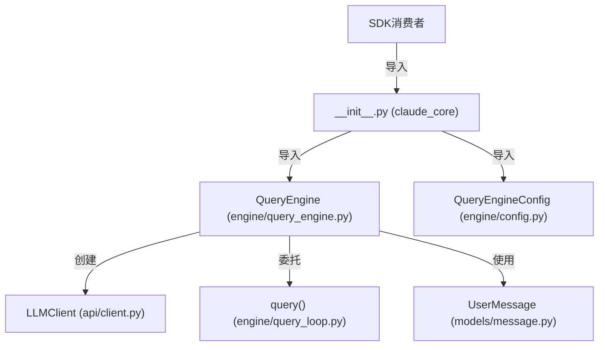

# SDK 入口点

## 模块职责
SDK 入口模块暴露 ClaudeCore 包的版本号，作为 SDK 的主要导入位置。它在包根目录提供最小接口，而核心功能位于 `engine` 子模块中。

## 核心接口
| 接口 | 文件位置 | 描述 |
|------|----------|-------|
| `__version__` | `__init__.py:3` | SDK 版本字符串常量 |
| QueryEngine | `engine/query_engine.py:17` | 高级编排器，管理对话生命周期和会话状态 |
| QueryEngineConfig | `engine/config.py` | QueryEngine 初始化的配置数据类 |
| QueryParams | `engine/types.py` | 查询执行参数，包括消息、系统提示、工具 |

## 调用来源
- 外部 SDK 消费者（主导入入口）

## 调用目标
- QueryEngine (`engine/query_engine.py`)
- API 客户端模块 (`api/client.py`)
- 查询循环模块 (`engine/query_loop.py`)
- 消息模型 (`models/message.py`)

## 关键逻辑
1. SDK 消费者从 `claude_core` 包根目录导入以访问 `__version__`
2. QueryEngine 类是 SDK 使用的主要接口——必须从 `claude_core.engine` 导入
3. QueryEngine 使用包含 base_url、api_key、model、timeout 和 max_turns 的 QueryEngineConfig 初始化
4. QueryEngine 管理内部状态，包括消息历史、中止控制器、权限拒绝和 API 使用量跟踪
5. 提交消息时，QueryEngine 构建 QueryParams 并委托给 `engine/query_loop.py` 中的查询循环

## 调用关系图

