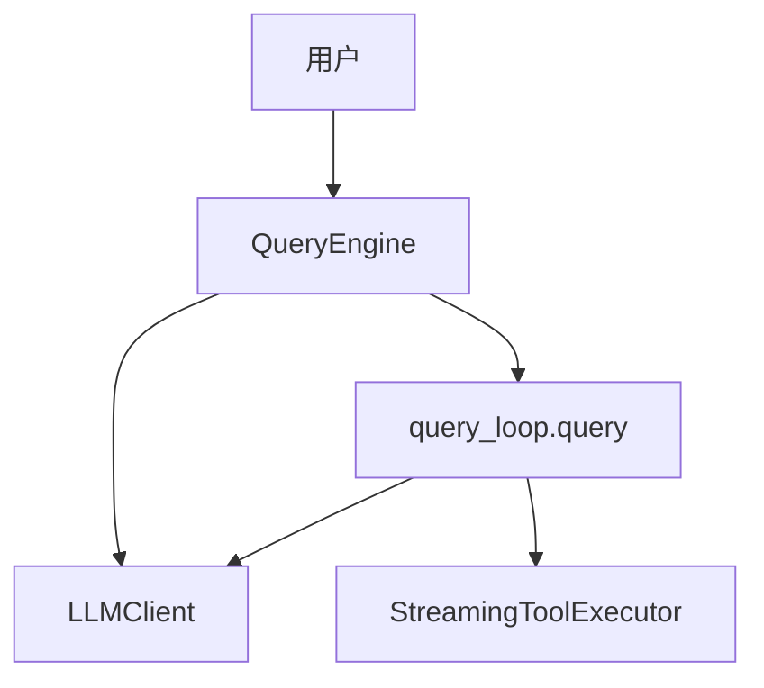

# QueryEngine (查询引擎)

## 模块职责
高级查询编排器，管理对话生命周期和会话状态。管理消息历史、处理用户输入、跟踪 API 使用量，并将实际的 LLM 通信委托给 query loop。

## 核心接口
| 接口 | 文件位置 | 描述 |
|------|----------|-------|
| `QueryEngine` | `query_engine.py:17` | 主要编排器类，管理会话状态 |
| `submit_message()` | `query_engine.py:57` | 提交用户消息，yield 流式事件 |
| `_get_client()` | `query_engine.py:46` | 懒创建 LLMClient |
| `QueryEngineConfig` | `config.py:7` | 配置数据类 |

## 调用来源
- SDK 入口 (__init__.py)
- Agent Worker (agents/worker.py) 用于嵌套查询

## 调用目标
- query_loop.query (query_loop.py) - 委托 LLM 交互和工具执行
- LLMClient (client.py) - 懒创建用于 API 通信

## 关键逻辑
1. `submit_message()` 接收用户内容，创建 UserMessage，追加到消息历史
2. 构建 QueryParams（消息、系统提示、工具配置），委托给 query()
3. query() yield StreamEvents，submit_message 转发给调用者
4. `_get_client()` 在首次使用时懒创建 LLMClient

## 调用关系图

