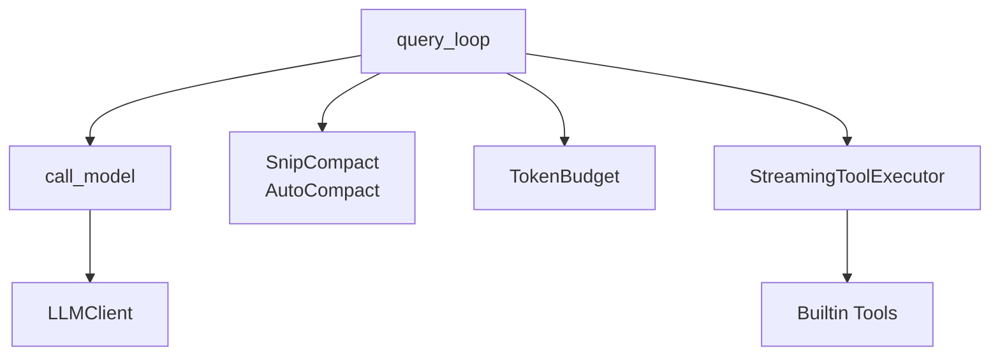

# Query Loop (查询循环)

## 模块职责
核心异步生成器，协调 LLM 交互的完整生命周期：流式响应、工具执行、上下文压缩、错误恢复（重试和模型回退）。

## 核心接口
| 接口 | 文件位置 | 描述 |
|------|----------|-------|
| `call_model()` | `query_loop.py:30` | 流式调用 API，yield 内容片段和工具调用事件 |
| `query()` | `query_loop.py:139` | 主异步生成器循环 |
| `QueryParams` | `types.py:18` | 查询函数输入参数 |
| `QueryState` | `types.py:34` | 跨循环迭代的可变状态 |
| `Continue` | `types.py:9` | 信号循环继续 |
| `Stop` | `types.py:13` | 信号循环终止 |

## 调用来源
- QueryEngine.submit_message() (engine/query_engine.py)

## 调用目标
- LLMClient (api/client.py) 通过 call_model()
- SnipCompact, AutoCompactStrategy (context/compression.py)
- StreamingToolExecutor (tools/streaming_executor.py)
- TokenBudget (context/budget.py)

## 关键逻辑
1. **初始化**: 设置压缩策略、TokenBudget、max-output 恢复状态
2. **主循环**: 检查 max_turns、abort 信号、预算；消息超阈值时应用 snip_compact
3. **API 调用**: call_model() 流式返回内容片段和工具调用事件
4. **错误恢复**: prompt-too-long 触发 reactive_compact；max-output 双倍 tokens 重试；模型回退
5. **工具执行**: StreamingToolExecutor 并发运行工具

## 调用关系图

