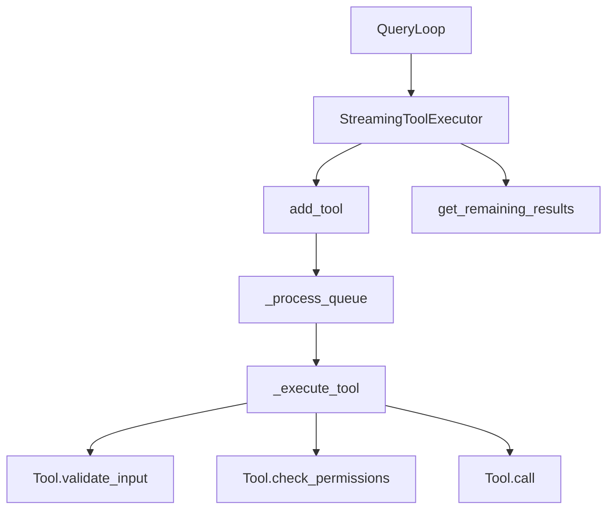

# Tool System (工具系统)

## 模块职责
提供工具执行基础设施，支持流式处理和并发工具执行。处理从验证到执行再到结果交付的完整工具生命周期。

## 核心接口
| 接口 | 文件位置 | 描述 |
|------|----------|-------|
| `Tool` | `base.py:38` | 工具协议：validate_input, check_permissions, call |
| `ToolImpl` | `base.py:87` | 具体工具实现 |
| `ValidationResult` | `base.py:15` | 输入验证结果 |
| `PermissionResult` | `base.py:23` | 权限检查结果 |
| `ToolResult` | `base.py:30` | 工具执行结果 |
| `ToolStatus` | `streaming_executor.py:15` | 枚举：QUEUED, EXECUTING, COMPLETED, YIELDED |
| `TrackedTool` | `streaming_executor.py:22` | 跟踪单个工具执行状态 |
| `StreamingToolExecutor` | `streaming_executor.py:59` | 异步并发执行到达的工具 |

## 调用来源
- Query Loop (engine/query_loop.py)

## 调用目标
- 工具实现 (tools/builtin/*.py)
- Abort controller (utils/abort.py)

## 关键逻辑
1. `add_tool()` 接收 ToolUseBlock，创建 TrackedTool，触发 `_process_queue()`
2. `_process_queue()` 评估并发安全性，无阻塞时立即执行
3. `_execute_tool()` 完整流程：validate_input → check_permissions → call
4. `get_remaining_results()` yield 完成的工具结果
5. `get_updated_context()` 应用 context_modifiers

## 调用关系图

