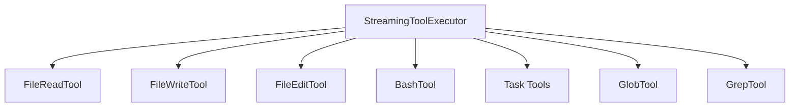

# Builtin Tools (内置工具)

## 模块职责
实现 7 个核心内置工具：FileRead、FileWrite、FileEdit、Bash、Task（4个操作）、Glob、Grep。所有工具遵循 Tool 协议。

## 核心接口
| 接口 | 文件位置 | 描述 |
|------|----------|-------|
| `FileReadTool` | `builtin/file_read.py` | 读取文件内容，100KB 限制 |
| `FileWriteTool` | `builtin/file_write.py` | 写入文件，创建父目录 |
| `FileEditTool` | `builtin/file_edit.py` | 字符串替换编辑文件 |
| `BashTool` | `builtin/bash.py` | 执行 shell 命令，60s 超时 |
| `TaskCreateTool` | `builtin/task.py` | 创建任务 |
| `TaskUpdateTool` | `builtin/task.py` | 更新任务 |
| `TaskListTool` | `builtin/task.py` | 列出任务 |
| `TaskGetTool` | `builtin/task.py` | 获取任务详情 |
| `GlobTool` | `builtin/glob.py` | 匹配 glob 模式 |
| `GrepTool` | `builtin/grep.py` | 正则搜索文件内容 |

## 调用来源
- StreamingToolExecutor (tools/streaming_executor.py)

## 调用目标
- 标准库：os, subprocess, pathlib, re

## 关键逻辑
1. 每个工具实现 Tool 协议：name, description, input_schema, call()
2. call() 接收 (input, context, can_use_tool, on_progress)
3. FileRead: 读文件，超限截断
4. FileWrite: 创建目录，写入内容
5. FileEdit: str.replace() 替换
6. Bash: subprocess.run() 执行命令
7. Task: 内存 dict 存储 CRUD

## 调用关系图

