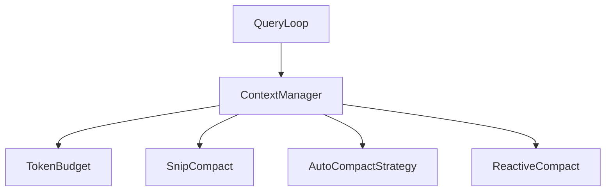

# Context Manager (上下文管理)

## 模块职责
管理 token 预算和上下文窗口，通过三种压缩策略防止 prompt-too-long 错误。

## 核心接口
| 接口 | 文件位置 | 描述 |
|------|----------|-------|
| `ContextManager` | `manager.py:31` | 主要上下文管理器 |
| `TokenBudget` | `budget.py:7` | 跟踪已用/剩余 tokens |
| `SnipCompact` | `compression.py:303` | 删除中间消息，保留首尾 |
| `AutoCompactStrategy` | `compression.py:354` | 阈值触发的自动压缩 |
| `ReactiveCompact` | `compression.py:413` | 413 错误后的激进压缩 |
| `MODEL_CONTEXT_WINDOWS` | `manager.py:20` | 模型上下文窗口大小映射 |

## 调用来源
- Query Loop (engine/query_loop.py)

## 调用目标
- SnipCompact, AutoCompactStrategy, ReactiveCompact (compression.py)
- TokenBudget (budget.py)

## 关键逻辑
1. ContextManager.__init__() 从 MODEL_CONTEXT_WINDOWS 派生阈值
2. SnipCompact: 保留首消息+后半部分，加边界标记
3. AutoCompactStrategy: 阈值触发，保留最近消息
4. ReactiveCompact: 413 错误触发，更激进的 60k 阈值
5. TokenBudget.add_usage() 累计 tokens

## 调用关系图

