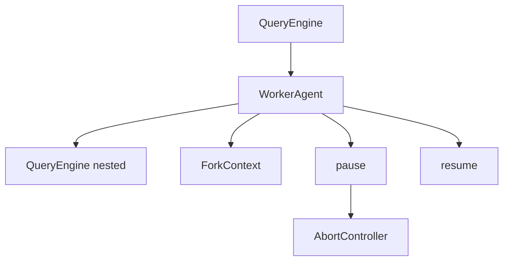

# Agent System (Agent 系统)

## 模块职责
实现 WorkerAgent 执行嵌套子代理查询，支持 fork 上下文跟踪、暂停/恢复状态机。

## 核心接口
| 接口 | 文件位置 | 描述 |
|------|----------|-------|
| `WorkerAgent` | `worker.py:18` | 通过 QueryEngine 执行任务 |
| `AgentStatus` | `types.py:5` | 枚举：IDLE, RUNNING, PAUSED, ERROR, STOPPED |
| `ForkContext` | `types.py:20` | 跟踪嵌套 chain_id 和 depth |
| `AgentConfig` | `types.py:30` | Agent 配置 |
| `pause()` | `worker.py:178` | 暂停执行 |
| `resume()` | `worker.py:188` | 恢复执行 |
| `run()` | `worker.py:108` | 通过 QueryEngine 执行 |

## 调用来源
- QueryEngine (engine/query_engine.py)
- 外部 API 消费者

## 调用目标
- QueryEngine (engine/query_engine.py)
- AbortController (utils/abort.py)

## 关键逻辑
1. WorkerAgent.__init__() 接收 AgentConfig
2. run() 创建 QueryEngine，调用 submit_message()
3. ForkContext(chain_id, depth) 跟踪嵌套 agents
4. pause() 设置状态为 PAUSED，abort 当前操作
5. resume() 恢复状态（不重启任务）
6. 状态机：IDLE → RUNNING → PAUSED → RUNNING

## 调用关系图

