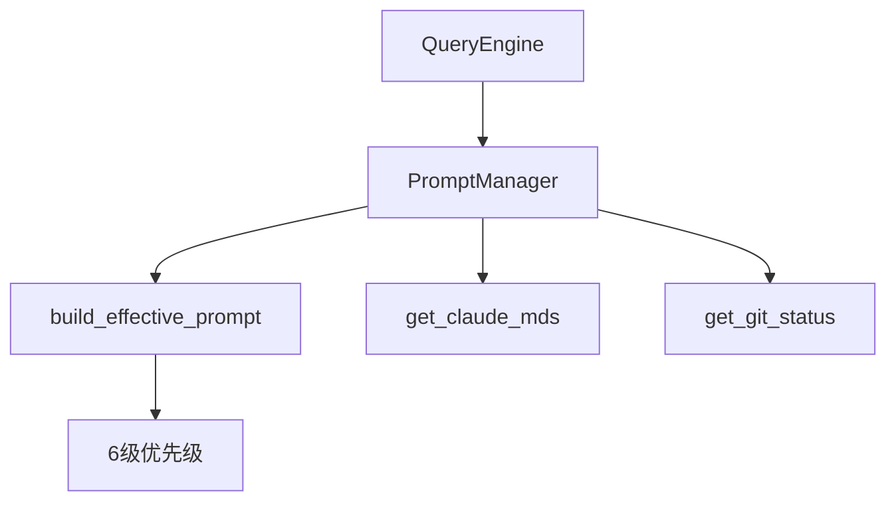

# Prompt Builder (Prompt 构建)

## 模块职责
通过 6 级优先级系统组合基础指令、工具、agents、上下文、git/CLAUDE.md 元数据，构建有效的系统提示。

## 核心接口
| 接口 | 文件位置 | 描述 |
|------|----------|-------|
| `build_effective_prompt()` | `builder.py:15` | 6 级优先级 prompt 构建 |
| `SystemPromptBuilder` | `builder.py:69` | 组合 base + tools + agents + context |
| `PromptManager` | `manager.py:15` | 模板存储和优先级构建 |
| `get_claude_mds()` | `parts.py:30` | 发现项目中的 CLAUDE.md |
| `get_git_status()` | `parts.py:56` | 获取 git 分支、状态、最近提交 |
| `build_git_context_section()` | `parts.py:119` | 格式化 git 上下文 |
| `build_claude_md_section()` | `parts.py:143` | 格式化 CLAUDE.md 内容 |

## 调用来源
- QueryEngine (engine/query_engine.py)

## 调用目标
- prompt/templates.py (DEFAULT_SYSTEM_TEMPLATE)
- subprocess (git 命令)

## 关键逻辑
1. PromptManager 接收请求，使用默认模板
2. build_effective_prompt() 应用 6 级优先级
3. 优先级顺序：override > coordinator > agent > custom > default + append
4. get_claude_mds() 遍历项目查找 **/CLAUDE.md
5. get_git_status() 执行 git 命令

## 调用关系图

