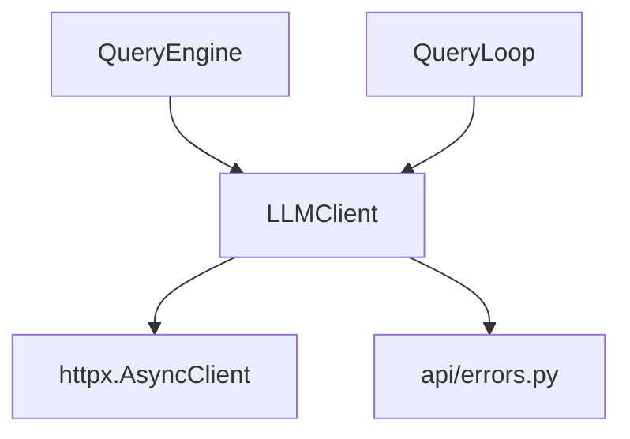

# API Client (API 客户端)

## 模块职责
提供 OpenAI 兼容的 LLM 客户端，处理 HTTP 通信、重试逻辑、错误映射。

## 核心接口
| 接口 | 文件位置 | 描述 |
|------|----------|-------|
| `LLMClient` | `client.py:30` | OpenAI 兼容异步 HTTP 客户端 |
| `chat_completion()` | `client.py:87` | 带重试的非流式聊天完成 |
| `_map_status_to_error()` | `client.py:64` | HTTP 状态码映射为 APIError |
| `APIError` | `errors.py:6` | 基础异常 |
| `RateLimitError` | `errors.py:25` | 429 错误 |
| `AuthenticationError` | `errors.py:32` | 401/403 认证失败 |
| `InvalidRequestError` | `errors.py:38` | 400 错误 |
| `APIConnectionError` | `errors.py:44` | 5xx 服务器错误 |
| `is_retryable_error()` | `errors.py:50` | 判断是否可重试 |

## 调用来源
- QueryEngine (engine/query_engine.py)
- QueryLoop (engine/query_loop.py)

## 调用目标
- httpx.AsyncClient

## 关键逻辑
1. LLMClient.__init__() 存储 base_url, api_key, model, timeout, max_retries
2. chat_completion() 发送 POST，带指数退避重试
3. _map_status_to_error() 转换：401/403→认证错误，400→请求错误，429→限流，5xx→连接错误
4. is_retryable_error() 对 429 或 >= 500 返回 true
5. 重试延迟从 1s 开始，每次倍增

## 调用关系图

