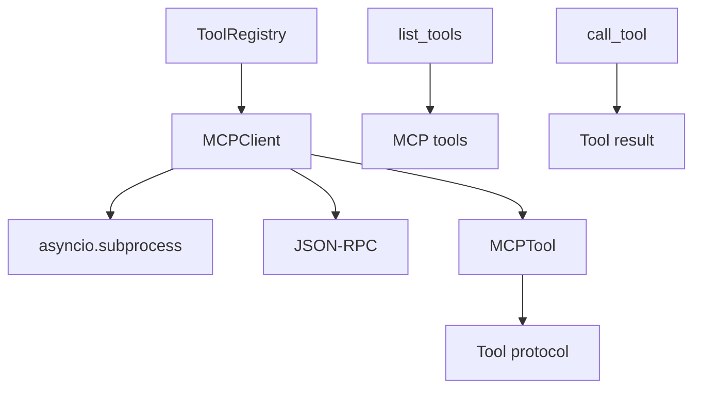

# MCP Client (MCP 客户端)

## 模块职责
提供 MCP (Model Context Protocol) 客户端，通过子进程连接外部 MCP 服务器，通过 stdin/stdout 的 JSON-RPC 2.0 暴露工具和资源。

## 核心接口
| 接口 | 文件位置 | 描述 |
|------|----------|-------|
| `MCPClient` | `client.py:16` | MCP 服务器通信主客户端 |
| `connect()` | `client.py:36` | 启动子进程连接 MCP 服务器 |
| `disconnect()` | `client.py:52` | 终止子进程连接 |
| `list_tools()` | `client.py:61` | JSON-RPC tools/list 请求 |
| `call_tool()` | `client.py:67` | JSON-RPC tools/call 请求 |
| `list_resources()` | `client.py:74` | JSON-RPC resources/list |
| `read_resource()` | `client.py:80` | JSON-RPC resources/read |
| `MCPTool` | `tool.py:18` | 包装 MCP 工具以符合 Tool 协议 |

## 调用来源
- Tool registry (tools/registry.py)

## 调用目标
- asyncio.subprocess
- json (JSON-RPC 序列化)

## 关键逻辑
1. MCPClient.connect() 启动子进程，连接 stdin/stdout
2. JSON-RPC 2.0：请求有 id, method, params；响应有 id, result 或 error
3. _send_request() 递增 request_id，写 JSON 到 stdin，读取响应
4. MCPTool 包装 MCP 工具实现 Tool 协议

## 调用关系图

