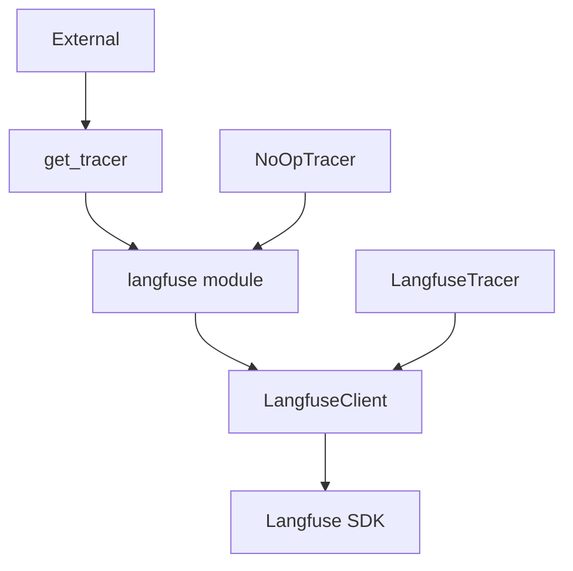

# Langfuse Tracing (分布式追踪)

## 模块职责
通过 Langfuse 提供 LLM 调用和工具执行的分布式追踪，在 Langfuse 不可用时自动回退到 no-op 实现。

## 核心接口
| 接口 | 文件位置 | 描述 |
|------|----------|-------|
| `LangfuseClient` | `client.py:9` | 包装 Langfuse SDK，懒初始化 |
| `LangfuseTracer` | `__init__.py:14` | 为查询会话创建 traces 和 spans |
| `NoOpTracer` | `__init__.py:81` | Langfuse 不可用时的回退追踪器 |
| `get_tracer()` | `__init__.py:109` | 返回单例追踪器实例 |
| `set_tracer()` | `__init__.py:126` | 设置全局追踪器实例 |
| `get_client()` | `client.py:100` | 返回单例客户端 |
| `configure()` | `client.py:108` | 配置客户端凭据 |

## 调用来源
- Query handler / 编排层 (外部调用)

## 调用目标
- langfuse SDK (langfuse 包)

## 关键逻辑
1. LangfuseClient 从环境变量读取凭据：LANGFUSE_PUBLIC_KEY, LANGFUSE_SECRET_KEY, LANGFUSE_HOST
2. 懒初始化：首次 API 调用时才导入 Langfuse SDK
3. get_tracer() 尝试导入 langfuse，失败时回退到 NoOpTracer
4. 所有 span/trace end 操作包装在 try-except 中

## 调用关系图

