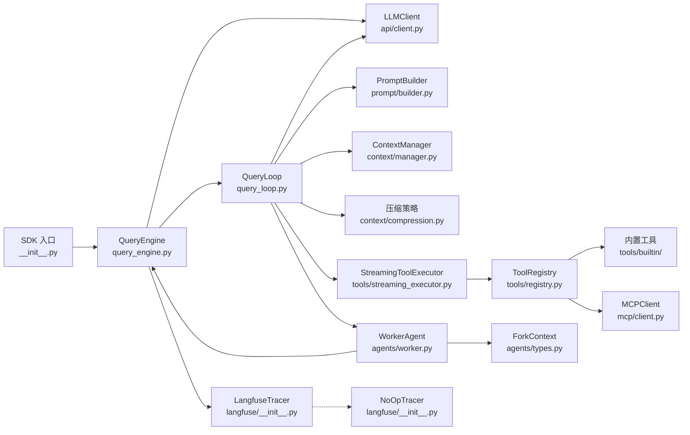

# Claude Core 代码阅读文档库

本文档库提供 Claude Core SDK 的完整代码阅读指南，按模块依赖顺序组织，从入口点沿调用链逐步深入。

## 模块概览

| 序号 | 模块 | 文件位置 | 职责 |
|------|------|----------|------|
| 01 | SDK 入口 | `__init__.py` | 版本暴露，主导入点 |
| 02 | 查询引擎 | `engine/query_engine.py` | 高级编排器，管理会话状态 |
| 03 | 查询循环 | `engine/query_loop.py` | 核心生成器，处理流式、工具、压缩 |
| 04 | 工具系统 | `tools/streaming_executor.py` | 并发工具执行与验证 |
| 05 | 内置工具 | `tools/builtin/` | Read/Search/Write/Web 等内置工具 |
| 06 | 上下文管理 | `context/manager.py` | 令牌预算与上下文窗口管理 |
| 07 | Agent 系统 | `agents/worker.py` | 嵌套子代理执行与状态机 |
| 08 | Prompt 构建 | `prompt/builder.py` | 6 级优先级系统 Prompt 构建 |
| 09 | API 客户端 | `api/client.py` | OpenAI 兼容 HTTP 客户端与重试 |
| 10 | MCP 客户端 | `mcp/client.py` | JSON-RPC 2.0 子进程通信 |
| 11 | 分布式追踪 | `langfuse/` | Langfuse 追踪与 NoOp 回退 |

## 完整调用链

## 调用流程说明

### 1. 外部调用入口
外部消费者导入 `claude_core` 包，通过 `QueryEngine` 发起查询请求。

### 2. QueryEngine 编排层
- 管理会话状态（消息历史、abort controller、API 使用量）
- 懒创建 LLMClient
- 委托给 QueryLoop 处理实际逻辑

### 3. QueryLoop 核心层
- 管理对话循环生命周期
- 通过 LLMClient 发送 API 请求
- 通过 PromptBuilder 构建系统 Prompt
- 通过 ContextManager 管理令牌预算
- 通过 StreamingToolExecutor 并发执行工具

### 4. 工具执行层
- ToolRegistry 发现和管理工具
- StreamingToolExecutor 验证输入、权限，并发执行
- 内置工具（Read/Search/Write/Web）直接执行
- MCP 工具通过子进程 JSON-RPC 通信

### 5. Agent 嵌套层
- WorkerAgent 支持嵌套子代理
- ForkContext 跟踪 chain_id 和 depth
- 状态机：IDLE → RUNNING → PAUSED → RUNNING

### 6. 追踪层
- LangfuseTracer 提供分布式追踪
- Langfuse 不可用时自动回退到 NoOpTracer

## 关键设计模式

### 懒初始化
- LLMClient 在首次使用时创建
- Langfuse SDK 在首次 API 调用时导入

### 6 级 Prompt 优先级
override > coordinator > agent > custom > default + append

### 令牌预算驱动压缩
根据模型上下文窗口（4K-200K）动态调整压缩阈值

### 并发工具执行
StreamingToolExecutor.validate_input() 和 check_permissions() 在工具调用前执行

## 阅读顺序建议

1. **起点**：`01-sdk-entry.md` - 了解入口和主要接口
2. **核心**：`02-query-engine.md` → `03-query-loop.md` - 理解编排和循环
3. **工具**：`04-tool-system.md` → `05-builtin-tools.md` - 掌握工具执行
4. **支撑**：`06-context.md` → `08-prompt.md` - 上下文和 Prompt 构建
5. **高级**：`07-agents.md` - Agent 嵌套执行
6. **底层**：`09-api-client.md` → `10-mcp.md` → `11-langfuse.md` - 基础设施
