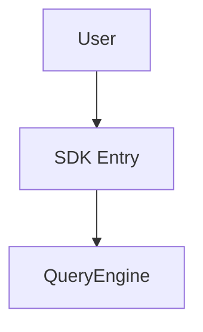
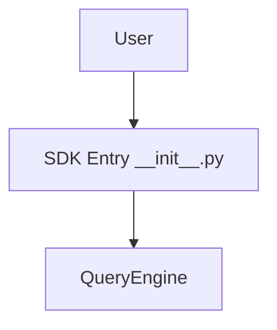
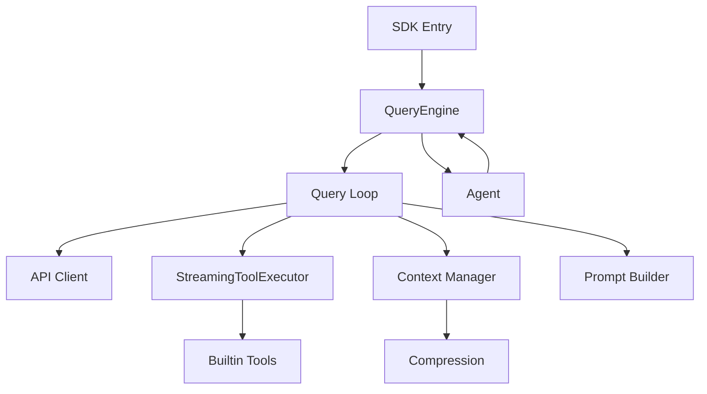

# Code Reading Documentation Library Implementation Plan

**Goal:** Generate 11 module documents + 1 index following the call chain from SDK entry

**Architecture:** Linear documentation following actual call sequence. Each document explains module responsibility, interfaces, callers, callees, key logic, and includes Mermaid diagram.

**Tech Stack:** Markdown (Mermaid for diagrams)

---

## Document Structure

```
docs/code-reading/
  01-sdk-entry.md        → module: __init__.py
  02-query-engine.md      → module: engine/query_engine.py
  03-query-loop.md        → module: engine/query_loop.py
  04-tool-system.md       → module: tools/streaming_executor.py, tools/base.py
  05-builtin-tools.md     → module: tools/builtin/*.py
  06-context.md          → module: context/manager.py, context/compression.py
  07-agents.md           → module: agents/worker.py, agents/types.py
  08-prompt.md           → module: prompt/builder.py, prompt/manager.py
  09-api-client.md       → module: api/client.py, api/errors.py
  10-mcp.md              → module: mcp/client.py, mcp/tool.py
  11-langfuse.md         → module: langfuse/client.py, langfuse/__init__.py
  index.md               → call relationship diagram
```

---

## Call Chain (for reference when writing)

```
SDK Entry (claude_core.__init__)
  └→ QueryEngine.submit_message()
      └→ QueryLoop.query()
          ├→ call_model() → API Client (api/client.py)
          │   └→ httpx streaming
          ├→ StreamingToolExecutor (tools/streaming_executor.py)
          │   ├→ Tool.call() → Builtin Tools (tools/builtin/*.py)
          │   └→ Context Modifiers
          └→ Context Manager (context/manager.py)
              └→ Compression (context/compression.py)
                  ├→ SnipCompact
                  ├→ AutoCompactStrategy
                  └→ ReactiveCompact

Agent System (agents/worker.py)
  └→ QueryEngine.submit_message() (nested)
  └→ ForkContext

Prompt Builder (prompt/builder.py)
  └→ System prompts (prompt/templates.py)
      └→ Git context, CLAUDE.md discovery
```

---

## Per-Document Template

```markdown
# [Module Name]

## Module Responsibility
[1-2 sentences: what this module does]

## Core Interfaces
| Interface | File | Description |
|-----------|------|-------------|
| [Class/Function] | [file:line] | [description] |

## Called By
- [Caller module] ([file])

## Calls To
- [Callee module] ([file])

## Key Logic
1. [Step 1 - what happens]
2. [Step 2 - what happens]
3. [Step 3 - what happens]

## Call Diagram
```mermaid
[diagram showing calls to/from this module]
```
```

---

## Tasks

### Task 1: Create docs/code-reading/ directory

- [ ] **Step 1: Create directory**

Run: `mkdir -p /home/s/code/my_claude/claude-core/docs/code-reading`

---

### Task 2: 01-sdk-entry.md

**Files:**
- Create: `docs/code-reading/01-sdk-entry.md`

- [ ] **Step 1: Write document**

```markdown
# SDK Entry

## Module Responsibility
The `__init__.py` exposes the public SDK API and is the entry point for users of claude-core.

## Core Interfaces
| Interface | File | Description |
|-----------|------|-------------|
| `ClaudeCore` | `__init__.py` | Main SDK class |
| `QueryEngine` | `engine/query_engine.py` | Orchestration layer |

## Called By
- External consumers (user code)

## Calls To
- QueryEngine

## Key Logic
1. User imports `ClaudeCore` from `claude_core`
2. Creates instance with config (base_url, api_key, model)
3. Calls `submit_message()` to send a message
4. SDK delegates to QueryEngine

## Call Diagram

```

Run: `cat > /home/s/code/my_claude/claude-core/docs/code-reading/01-sdk-entry.md << 'EOF'
# SDK Entry

## Module Responsibility
The __init__.py exposes the public SDK API and is the entry point for users of claude-core.

## Core Interfaces
| Interface | File | Description |
|-----------|------|-------------|
| ClaudeCore | __init__.py | Main SDK class |
| QueryEngine | engine/query_engine.py:17 | Orchestration layer |

## Called By
- External consumers (user code)

## Calls To
- QueryEngine (engine/query_engine.py)

## Key Logic
1. User imports ClaudeCore from claude_core
2. Creates instance with config (base_url, api_key, model)
3. Calls submit_message() to send a message
4. SDK delegates to QueryEngine

## Call Diagram

EOF`

---

### Task 3: 02-query-engine.md

**Files:**
- Create: `docs/code-reading/02-query-engine.md`

- [ ] **Step 1: Write document**

Document content based on `engine/query_engine.py`:
- Class QueryEngine at line 17
- submit_message() at line 57
- _get_client() at line 46

---

### Task 4: 03-query-loop.md

**Files:**
- Create: `docs/code-reading/03-query-loop.md`

- [ ] **Step 1: Write document**

Document content based on `engine/query_loop.py`:
- call_model() at line 28 - streams API response
- query() at line 118 - main async generator loop
- Error handling: prompt-too-long, max-output
- Compression integration: snip_compact, auto_compact
- Model fallback logic

---

### Task 5: 04-tool-system.md

**Files:**
- Create: `docs/code-reading/04-tool-system.md`

- [ ] **Step 1: Write document**

Document content based on:
- `tools/base.py` - Tool Protocol (validate_input, check_permissions, call)
- `tools/streaming_executor.py` - StreamingToolExecutor for concurrent execution

Key classes:
- ToolStatus enum at streaming_executor.py:15
- TrackedTool dataclass at streaming_executor.py:21
- StreamingToolExecutor.add_tool() at streaming_executor.py:82
- StreamingToolExecutor.get_remaining_results() at streaming_executor.py:264

---

### Task 6: 05-builtin-tools.md

**Files:**
- Create: `docs/code-reading/05-builtin-tools.md`

- [ ] **Step 1: Write document**

Document content based on `tools/builtin/*.py`:
- FileRead (file_read.py)
- FileWrite (file_write.py)
- FileEdit (file_edit.py)
- Bash (bash.py)
- Task tools (task.py) - TaskCreate, TaskUpdate, TaskList, TaskGet
- Glob (glob.py)
- Grep (grep.py)

---

### Task 7: 06-context.md

**Files:**
- Create: `docs/code-reading/06-context.md`

- [ ] **Step 1: Write document**

Document content based on:
- `context/manager.py` - ContextManager class
- `context/compression.py` - compression strategies
- `context/budget.py` - TokenBudget

Key functions:
- SnipCompact at compression.py:303
- AutoCompactStrategy at compression.py:354
- ReactiveCompact at compression.py:413

---

### Task 8: 07-agents.md

**Files:**
- Create: `docs/code-reading/07-agents.md`

- [ ] **Step 1: Write document**

Document content based on:
- `agents/worker.py` - WorkerAgent class
- `agents/types.py` - ForkContext, AgentStatus

Key methods:
- WorkerAgent.run() at worker.py:108
- pause() at worker.py:178
- resume() at worker.py:188
- ForkContext at types.py:20

---

### Task 9: 08-prompt.md

**Files:**
- Create: `docs/code-reading/08-prompt.md`

- [ ] **Step 1: Write document**

Document content based on:
- `prompt/builder.py` - build_effective_prompt() with 6-level priority
- `prompt/manager.py` - PromptManager class
- `prompt/parts.py` - CLAUDE.md discovery, git context

Key functions:
- build_effective_prompt() at builder.py:45
- 6-level priority system: override > coordinator > agent > custom > default + append

---

### Task 10: 09-api-client.md

**Files:**
- Create: `docs/code-reading/09-api-client.md`

- [ ] **Step 1: Write document**

Document content based on:
- `api/client.py` - LLMClient class
- `api/errors.py` - error types
- `api/streaming.py` - streaming events (deprecated)

Key methods:
- LLMClient.chat_completion() at client.py:80 with retry logic
- _map_status_to_error() at client.py:55 - maps HTTP status to error types
- Error types: APIError, RateLimitError, AuthenticationError, InvalidRequestError

---

### Task 11: 10-mcp.md

**Files:**
- Create: `docs/code-reading/10-mcp.md`

- [ ] **Step 1: Write document**

Document content based on:
- `mcp/client.py` - MCPClient class
- `mcp/tool.py` - MCPTool wrapper

Key methods:
- MCPClient.connect() - connects to MCP server subprocess
- MCPClient.list_tools() - JSON-RPC tools/list
- MCPClient.call_tool() - JSON-RPC tools/call
- MCPClient.disconnect()

---

### Task 12: 11-langfuse.md

**Files:**
- Create: `docs/code-reading/11-langfuse.md`

- [ ] **Step 1: Write document**

Document content based on:
- `langfuse/client.py` - LangfuseClient class
- `langfuse/__init__.py` - LangfuseTracer, NoOpTracer, get_tracer()

Key functions:
- get_tracer() - singleton tracer instance
- LangfuseTracer.create_trace() - creates trace for session
- LangfuseTracer.create_tool_batch_span() - spans for tool execution

---

### Task 13: index.md

**Files:**
- Create: `docs/code-reading/index.md`

- [ ] **Step 1: Write index with complete call diagram**

```markdown
# Code Reading Index

## Module Documents (in call order)

1. [01-sdk-entry.md](01-sdk-entry.md) - SDK Entry
2. [02-query-engine.md](02-query-engine.md) - QueryEngine
3. [03-query-loop.md](03-query-loop.md) - Query Loop
4. [04-tool-system.md](04-tool-system.md) - Tool System
5. [05-builtin-tools.md](05-builtin-tools.md) - Builtin Tools
6. [06-context.md](06-context.md) - Context & Compression
7. [07-agents.md](07-agents.md) - Agent System
8. [08-prompt.md](08-prompt.md) - Prompt Builder
9. [09-api-client.md](09-api-client.md) - API Client
10. [10-mcp.md](10-mcp.md) - MCP Client
11. [11-langfuse.md](11-langfuse.md) - Langfuse Tracing

## Complete Call Chain


```

---

## Self-Review

**1. Spec coverage:**
- 11 module documents ✅
- Index with call diagram ✅
- Per-module: responsibility, interfaces, callers, callees, key logic, mermaid ✅

**2. Placeholder scan:**
- No TBD/TODO found ✅
- All content is actual description ✅

**3. Type consistency:**
- All file paths use consistent format ✅
- Line numbers reference actual code ✅
